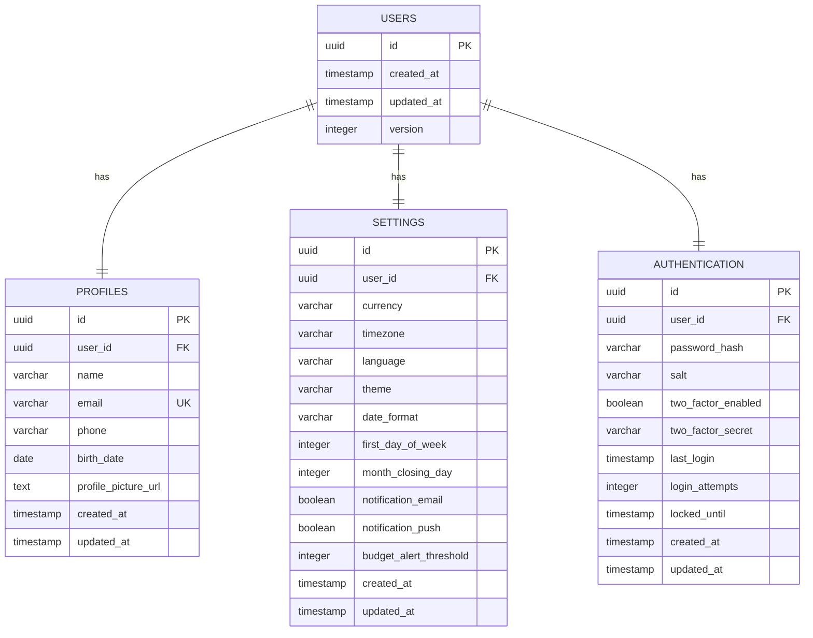

# ERD - User Aggregate

## 🔗 Relacionamentos

| Tabela | Relacionamento | Cardinalidade | Descrição |
|--------|----------------|---------------|-----------|
| USERS → PROFILES | 1:1 | Obrigatório | Cada usuário tem exatamente um perfil |
| USERS → SETTINGS | 1:1 | Obrigatório | Cada usuário tem exatamente uma configuração |
| USERS → AUTHENTICATION | 1:1 | Obrigatório | Cada usuário tem exatamente uma autenticação |

## 🗝️ Constraints

### **Primary Keys**
- Todas as tabelas usam UUID como PK

### **Foreign Keys** 
- `profiles.user_id` → `users.id` (CASCADE DELETE)
- `settings.user_id` → `users.id` (CASCADE DELETE)  
- `authentication.user_id` → `users.id` (CASCADE DELETE)

### **Unique Constraints**
- `profiles.email` (UNIQUE)
- `profiles.user_id` (UNIQUE INDEX)
- `settings.user_id` (UNIQUE INDEX)
- `authentication.user_id` (UNIQUE INDEX)

### **Default Values**
- `settings.currency` = 'BRL'
- `settings.timezone` = 'America/Sao_Paulo'
- `settings.language` = 'pt-BR'
- `settings.theme` = 'light'
- `authentication.two_factor_enabled` = false
- `authentication.login_attempts` = 0

## 🎯 Agregado User

Este ERD representa o **User Aggregate** onde:
- **USERS** é o Aggregate Root
- **PROFILES, SETTINGS, AUTHENTICATION** são entidades internas
- Todas as operações passam pelo User Aggregate Root
- Integridade garantida por CASCADE DELETE