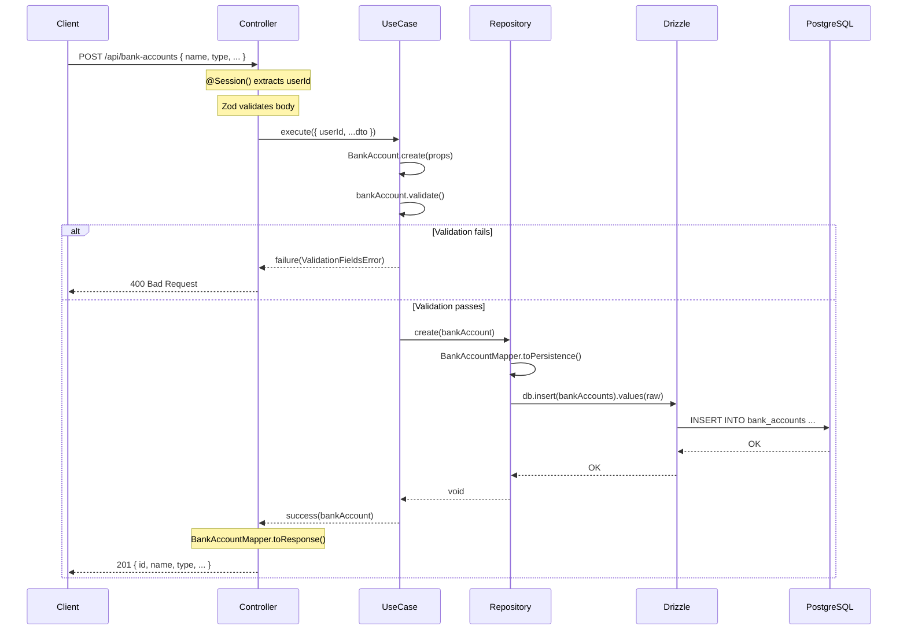

# Bank Accounts Implementation Plan

## Context

Designed the complete first domain module (RF01 - Contas e Carteiras) for the backend. This is the foundational module — Transactions, Categories, Budgets all depend on Bank Accounts existing first. The plan follows all DDD kernel patterns already established in `shared/domain/`.

## Findings

### Module Structure (18 new files)

```
apps/api/src/
├── modules/
│   └── bank-accounts/
│       ├── bank-accounts.module.ts              # NestJS module
│       ├── domain/
│       │   ├── bank-account.entity.ts           # Entity extending Entity<T>
│       │   ├── bank-account.validator.ts        # ZodValidationStrategy
│       │   └── bank-account-type.ts             # as const + union type (NO enum)
│       ├── infra/
│       │   ├── persistence/
│       │   │   ├── bank-account.repository.ts   # Abstract class (for DI)
│       │   │   └── drizzle-bank-account.repository.ts  # Drizzle implementation
│       │   └── mappers/
│       │       └── bank-account.mapper.ts       # Entity <-> DB <-> Response
│       ├── create-bank-account/
│       │   ├── create-bank-account.use-case.ts
│       │   ├── create-bank-account.dto.ts       # Zod schema + inferred type
│       │   └── create-bank-account.controller.ts
│       ├── list-bank-accounts/
│       │   ├── list-bank-accounts.use-case.ts
│       │   └── list-bank-accounts.controller.ts
│       ├── update-bank-account/
│       │   ├── update-bank-account.use-case.ts
│       │   ├── update-bank-account.dto.ts
│       │   └── update-bank-account.controller.ts
│       └── delete-bank-account/
│           ├── delete-bank-account.use-case.ts
│           └── delete-bank-account.controller.ts
└── core/
    └── database/
        └── drizzle/
            └── schemas/
                └── bank-account-schema.ts       # Drizzle table definition
```

### Drizzle Schema Design

Table `bank_accounts` with the following columns:

| Column | Type | Constraints | Notes |
|---|---|---|---|
| `id` | `text` | PK | UUIDv4 (same as auth tables) |
| `user_id` | `text` | FK -> users.id, CASCADE DELETE, NOT NULL | Scoping — all queries filter by userId |
| `name` | `text` | NOT NULL | e.g., "Nubank", "Carteira" |
| `type` | `pgEnum("bank_account_type")` | NOT NULL | PostgreSQL enum: checking, savings, credit_card, cash, investment |
| `initial_balance` | `numeric(12,2)` | NOT NULL, DEFAULT "0" | Set once at creation |
| `current_balance` | `numeric(12,2)` | NOT NULL, DEFAULT "0" | Updated when transactions are added (future) |
| `currency` | `text` | NOT NULL, DEFAULT "BRL" | ISO 4217 code |
| `color` | `text` | NOT NULL | Hex color for UI (e.g., "#7950F2") |
| `icon` | `text` | nullable | Optional icon identifier |
| `created_at` | `timestamp` | NOT NULL, DEFAULT NOW | |
| `updated_at` | `timestamp` | NOT NULL, DEFAULT NOW, $onUpdate | |

Index: `bank_accounts_userId_idx` on `user_id`.

Key decisions:
- `pgEnum` is allowed at the database level (only TS `enum` is prohibited)
- `numeric(12,2)` supports up to 9,999,999,999.99 — sufficient for personal finance
- `numeric` returns as `string` from PostgreSQL — mapper converts to `number` in domain and back to `string` for persistence
- `currentBalance` is separate from `initialBalance` — will be recalculated when Transactions module is implemented

### Account Type Constants

Using `as const` object + derived union type (no TS enum):

```ts
export const BANK_ACCOUNT_TYPE = {
  CHECKING: "checking",
  SAVINGS: "savings",
  CREDIT_CARD: "credit_card",
  CASH: "cash",
  INVESTMENT: "investment",
} as const;

export type BankAccountType = typeof BANK_ACCOUNT_TYPE[keyof typeof BANK_ACCOUNT_TYPE];
// = "checking" | "savings" | "credit_card" | "cash" | "investment"
```

### Entity Pattern

`BankAccount extends Entity<BankAccountProps>` with:
- Private constructor + static `create()` factory
- Getters for all props
- `validate()` delegates to `BankAccountValidator` (ZodValidationStrategy)
- NOT an AggregateRoot yet — will upgrade when domain events are needed (e.g., balance changed events)

### Repository Pattern

- `BankAccountRepository` is an **abstract class** (not interface) — required for NestJS DI token
- Methods: `create`, `findById(id, userId)`, `findAllByUserId`, `update`, `delete(id, userId)`
- All queries are scoped by `userId` for data isolation
- `DrizzleBankAccountRepository` implements it, injected via module provider: `{ provide: BankAccountRepository, useClass: DrizzleBankAccountRepository }`

### Mapper Pattern (3 directions)

`BankAccountMapper` with static methods:
- `toDomain(raw)` — DB row (strings for numeric) -> Entity (numbers)
- `toPersistence(entity)` — Entity -> DB row (numbers back to strings)
- `toResponse(entity)` — Entity -> API response (dates as ISO strings, no userId)

### Controller Pattern

One controller per use case (same route prefix `"bank-accounts"`):
- `@Session() session: UserSession` — extracts authenticated user
- Body validated via Zod `.parse()` in controller
- Use case returns `Either<Error, Result>`
- Controller maps left side to NestJS HTTP exceptions (`NotFoundException`, etc.)

### API Endpoints

| Method | Route | Auth | Response |
|---|---|---|---|
| `POST` | `/api/bank-accounts` | Required | 201 + created account |
| `GET` | `/api/bank-accounts` | Required | 200 + array of accounts |
| `PUT` | `/api/bank-accounts/:id` | Required | 200 + updated account |
| `DELETE` | `/api/bank-accounts/:id` | Required | 204 No Content |

All routes protected by default (global better-auth guard). UserId always from session, never from client.

### Module Registration

Add `BankAccountsModule` to `app.module.ts` imports. No need to import `DatabaseModule` or `EnvModule` — they are `@Global()`.

## Flows



## Decisions / Open Questions

- Decision: Entity extends `Entity<T>` not `AggregateRoot<T>` — no domain events needed yet, upgrade later when Transactions module triggers balance recalculation
- Decision: One controller per use case — keeps each controller single-responsibility, NestJS handles multiple controllers with same route prefix
- Decision: Repository uses abstract class (not interface) — NestJS DI needs a class token for `provide:`
- Decision: `pgEnum` for `bank_account_type` in DB — database-level constraint is valuable, only TS `enum` is prohibited
- Decision: Zod validation in both DTO (controller) and Entity (domain) — defense in depth, DTO catches malformed input, entity enforces domain invariants
- Open: Error mapping from Either to HTTP exceptions is currently inline in each controller — may need a shared `ResultHandler` or NestJS exception filter later
- Open: No pagination on `GET /api/bank-accounts` yet — unlikely a user has enough accounts to need it, but Transactions will need it

## References

- `docs/1759610610-01-requisitos.md:16` — RF01 Contas e Carteiras requirement
- `docs/1760055212-02-dominios-subdominios.md:63-83` — Accounts & Wallets bounded context
- `apps/api/src/shared/domain/entities/entity.ts` — Entity base class pattern
- `apps/api/src/shared/domain/validators/zod-validation-strategy.ts` — Zod validation strategy
- `apps/api/src/shared/domain/types/either.ts` — Either monad for error handling
- `apps/api/src/core/database/drizzle/schemas/auth-schema.ts` — Reference schema (users FK target)
- `apps/api/src/core/database/constants.ts:1` — DRIZZLE_DB injection token
- `apps/api/src/app.module.ts` — Where to register the new module
